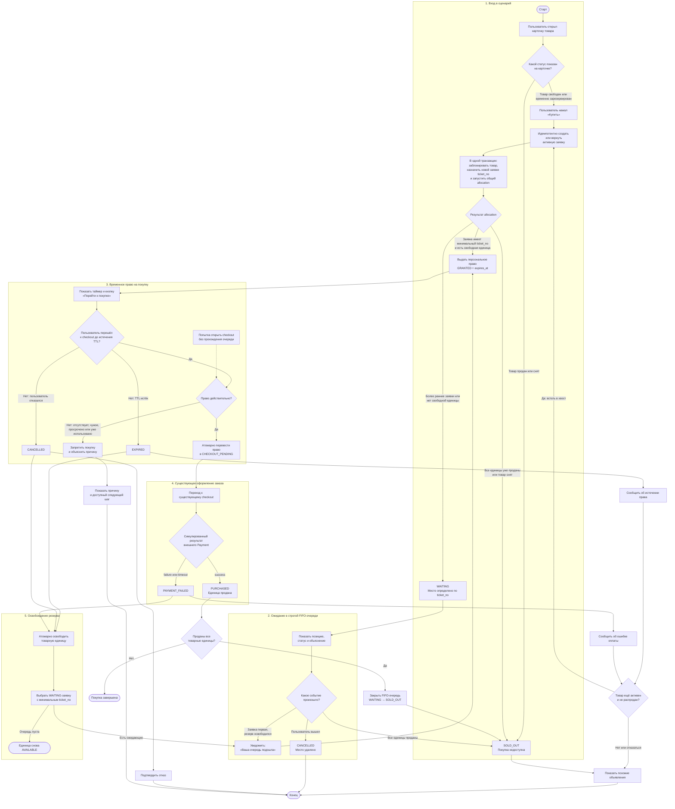
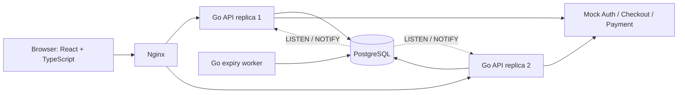

# Техническое задание: «Авито Честная очередь»

**Версия:** 1.2  
**Статус:** согласованная спецификация MVP  
**Дата:** 2026-08-05  
**Срок реализации:** 7 календарных дней  
**Команда:** 3 backend-разработчика, 1 frontend-разработчик

## 1. Назначение документа

Документ определяет продуктовые, функциональные и технические требования к MVP веб-приложения «Авито Честная очередь». Приложение демонстрирует строгую FIFO-очередь перед checkout для дефицитных и лимитированных товаров, временное персональное право на покупку и защиту от конкурентной продажи одной товарной единицы нескольким пользователям.

Документ является источником истины для разработки, тестирования, демонстрации и подготовки README. При переносе в репозиторий его следует сохранить как `docs/spec.md`.

## 2. Бизнес-контекст

При высоком спросе несколько покупателей могут одновременно начать оформление одного товара. Асинхронная оплата создаёт риск, что число оформленных заказов превысит остаток, а часть пользователей узнает об отсутствии товара только в конце пути.

MVP должен:

- распределять право на покупку последовательно и проверяемо;
- не допускать перепродажу одной товарной единицы;
- не позволять обходить очередь прямым переходом к checkout;
- ограничивать время удержания неоплаченного резерва;
- объяснять пользователю каждое состояние и следующий шаг;
- удерживать пользователя на платформе после неуспешной покупки.

## 3. Цели MVP

1. Реализовать строгую FIFO-очередь по серверному `ticket_no`.
2. Выдавать свободные товарные единицы через временное персональное право на покупку.
3. Атомарно передавать освободившуюся единицу следующему участнику очереди.
4. Защищать checkout от чужих, просроченных, повторных и отсутствующих прав.
5. Показать полный путь пользователя от карточки товара до одного из терминальных состояний.
6. Продемонстрировать корректность на конкурентной нагрузке и при двух экземплярах backend.
7. Развернуть приложение на публичном Ubuntu-сервере и обеспечить запуск через Docker Compose.

## 4. Что не входит в MVP

Согласно условиям кейса уже существуют и не реализуются заново:

- регистрация и полноценная авторизация;
- полноценное оформление заказа;
- реальная оплата;
- списание складских остатков после успешной оплаты.

Для демонстрации используются:

- переключатель demo-пользователя или заголовок `X-Demo-User-ID` вместо полноценной авторизации;
- mock-адаптеры существующих Checkout и Payment с результатами `success`, `failure` и `timeout`;
- локальная проекция результата внешней покупки для управления очередью; она не является полноценным заказом, реальной оплатой или складским списанием;
- тестовые товары и объявления, загружаемые seed-скриптом.

Также не входят в обязательный MVP:

- случайные розыгрыши и pre-queue;
- приоритетные и платные очереди;
- Redis, Kafka и микросервисное разбиение;
- email, SMS и push-уведомления;
- точный прогноз времени ожидания или вероятности покупки;
- встроенная AI-модель.

## 5. Продуктовые принципы

- **Строгий FIFO.** Следующим обслуживается активный участник `WAITING` с минимальным `ticket_no`.
- **Единый защищённый путь.** Даже при наличии свободного товара пользователь сначала получает право и только затем переходит к checkout.
- **Backend авторитетен.** Статусы на карточке и клиентский таймер информационные; решение принимает backend по данным PostgreSQL.
- **Нет серой зоны.** Каждое состояние содержит понятное сообщение и следующий шаг.
- **Корректность важнее пропускной способности.** MVP оптимизируется сначала под доказуемые гарантии, затем под нагрузку.
- **Восстановимость.** Обновление страницы, разрыв SSE и перезапуск API не меняют место пользователя.

### 5.1. Обоснование продуктовых решений

| Решение | Какую проблему решает | Бизнес-эффект |
|---|---|---|
| Строгий FIFO по серверному `ticket_no` | Убирает неоднозначность порядка при конкурентных запросах | Снижает число споров и делает результат проверяемым и понятным |
| Персональное одноразовое право | Не позволяет передать ссылку, войти в чужой checkout или использовать резерв повторно | Предотвращает некорректные заказы и обход очереди |
| TTL права | Не даёт одному неоплатившему пользователю удерживать товар бесконечно | Быстрее возвращает товар в продажу и повышает вероятность успешной покупки |
| Атомарный release и promotion | Исключает одновременную выдачу одной единицы и простой освободившегося резерва | Снижает ошибки распределения и повышает использование доступного остатка |
| Понятные состояния и следующий шаг | Убирает «серую зону» во время ожидания и ошибок | Снижает неопределённость, отказы и нагрузку на поддержку |
| Восстановление через REST после reload/reconnect | Не связывает место пользователя с одной вкладкой или SSE-соединением | Поддерживает ощущение честности при технических сбоях |
| Альтернативные объявления после неуспеха | Не оставляет пользователя в тупике после `SOLD_OUT` или ошибки | Удерживает пользователя на платформе и сохраняет вероятность покупки у другого продавца |

Альтернативные объявления являются дополнительной функцией, усиливающей бизнес-задачу. Они не заменяют очередь, право на покупку и защиту checkout.

## 6. Акторы

### 6.1. Покупатель

Открывает карточку товара, нажимает «Купить», получает право либо место в очереди, ожидает обновления и переходит к существующему checkout.

### 6.2. Сервис очереди

Создаёт место, назначает `ticket_no`, выдаёт временные права, обновляет статусы и автоматически продвигает очередь.

### 6.3. Существующие Auth, Checkout и Payment

Считаются внешними системами. В MVP представлены адаптерами с фиксированными контрактами.

### 6.4. Demo-оператор

Выбирает тестового пользователя, создаёт сценарий нагрузки и переключает mock-результат оплаты. Demo-функции не должны быть доступны в production-режиме без отдельного флага.

## 7. Эпик и user stories

### 7.1. Эпик

> Я, как покупатель Авито, хочу занимать прозрачное место в строгой FIFO-очереди и получать персональное ограниченное по времени право на покупку, чтобы результат не зависел от конкурентных запросов и технических гонок.

### 7.2. User stories

**US-01. Состояние товара**  
Я, как пользователь, хочу видеть состояние дефицитного товара, чтобы понимать, могу ли я попытаться его купить или встать в очередь.

**US-02. Вход в очередь**  
Я, как пользователь, хочу нажать «Купить», чтобы получить право сразу либо занять одно место в FIFO-очереди.

**US-03. Позиция**  
Я, как ожидающий пользователь, хочу видеть актуальную позицию, чтобы понимать состояние своей заявки.

**US-04. Обновления**  
Я, как ожидающий пользователь, хочу автоматически получать обновления и уведомление о наступлении моей очереди.

**US-05. Временное право**  
Я, как получивший право пользователь, хочу видеть оставшееся время и перейти к покупке, чтобы моё место не занял другой покупатель.

**US-06. Понятные причины**  
Я, как пользователь, хочу понимать причину ожидания, отказа, истечения права или окончания товара и видеть следующий шаг.

**US-07. Восстановление состояния**  
Я, как пользователь, хочу сохранить место после обновления страницы или повторного открытия приложения.

**US-08. Альтернативы**  
Я, как пользователь, не купивший товар, хочу увидеть похожие объявления, чтобы продолжить поиск на платформе.

### 7.3. Системные требования

**SR-01. Автоматическое продвижение**  
Если право истекло, пользователь отказался или оплата завершилась неуспешно, система атомарно освобождает единицу и выдаёт право участнику `WAITING` с минимальным `ticket_no`.

**SR-02. Защита checkout**  
Система запрещает покупку без активного персонального права на тот же товар и не позволяет использовать право повторно.

### 7.4. Трассировка требований

| История/требование | Реализация | Основная проверка |
|---|---|---|
| `US-01` | `FR-01`, карточка товара | Состояния `ACTIVE`/`SOLD_OUT`, серверная перепроверка при join |
| `US-02` | `FR-02`, `FR-03`, `FR-05` | Идемпотентный join даёт одно право или одно FIFO-место |
| `US-03` | `FR-04` | Позиция соответствует числу меньших активных `ticket_no` |
| `US-04` | `FR-09` | REST + SSE, reconnect не теряет состояние |
| `US-05` | `FR-05`, `FR-07`, `FR-08` | Персональный TTL, countdown и защищённый checkout |
| `US-06` | Раздел 10 и формат ошибок | Для каждого состояния есть причина и следующий шаг |
| `US-07` | `FR-04`, `FR-09` | Reload восстанавливает заявку по demo-идентичности |
| `US-08` | `FR-11` | Терминальный неуспешный экран показывает альтернативы |
| `SR-01` | `FR-06`, `FR-08` | Expiry/failure освобождает единицу и продвигает минимальный `ticket_no` |
| `SR-02` | `FR-07` | Нет, чужое, просроченное и использованное право отклоняются |

## 8. Термины

- **Товар (`product`)** — карточка дефицитного или лимитированного товара.
- **Товарная единица (`inventory_unit`)** — одна физически доступная единица товара.
- **Заявка (`queue_entry`)** — одна попытка конкретного пользователя купить конкретный товар.
- **`ticket_no`** — монотонно возрастающий номер заявки внутри товара; определяет FIFO-порядок.
- **Право (`purchase_grant`)** — временное персональное разрешение на checkout, привязанное к пользователю, товару и товарной единице.
- **Резерв** — локальное состояние товарной единицы, пока действует право или ожидается симулированный результат внешнего Payment.
- **SSE** — односторонний HTTP-канал для доставки браузеру уведомлений об изменении статуса.

## 9. Пользовательский сценарий

1. Пользователь открывает карточку товара.
2. Карточка показывает предварительный статус: свободен, временно зарезервирован или продан.
3. Если товар не продан, пользователь нажимает «Купить».
4. Backend идемпотентно создаёт либо возвращает активную заявку пользователя.
5. Backend атомарно перечитывает состояние товара, присваивает заявке следующий `ticket_no` и запускает общий алгоритм allocation.
6. Возможны три результата:
   - свободна единица и нет более раннего `WAITING` — создаётся `GRANTED` с `expires_at`;
   - все непроданные единицы временно зарезервированы — создаётся `WAITING`;
   - все единицы проданы или объявление снято — возвращается `SOLD_OUT`.
7. Пользователь `WAITING` видит позицию и получает изменения через SSE.
8. При освобождении единицы система выбирает минимальный `ticket_no`, создаёт право и отправляет уведомление.
9. Пользователь `GRANTED` видит таймер и кнопку «Перейти к покупке».
10. Backend валидирует право и атомарно переводит его в `CHECKOUT_PENDING`.
11. Mock-адаптер существующего Payment возвращает `success`, `failure` или `timeout`.
12. При `success` локальная проекция единицы становится `SOLD`, заявка — `PURCHASED`; реальный заказ и складское списание остаются во внешних системах.
13. При `failure`, `timeout`, отказе или истечении TTL единица освобождается и передаётся следующему участнику.
14. Если все единицы проданы, очередь закрывается, ожидающие получают `SOLD_OUT` и список альтернатив.
15. Пользователь с заявкой `EXPIRED`, `PAYMENT_FAILED` или `CANCELLED` может создать новую заявку только в конце очереди, если товар ещё активен и не распродан. После `SOLD_OUT` доступны только альтернативные объявления.

### 9.1. Визуальная схема MVP

Схема показывает основной и ключевые исключительные пути. Она не заменяет функциональные требования, таблицу состояний, API-контракты и бизнес-инварианты следующих разделов.



## 10. Пользовательские состояния

| Состояние | Сообщение | Следующий шаг |
|---|---|---|
| `JOINING` | «Добавляем вас в очередь» | Дождаться ответа |
| `WAITING` | «Вы №7 в очереди» | Ждать обновления или выйти |
| `GRANTED` | «Товар зарезервирован за вами на 02:00» | Перейти к покупке |
| `CHECKOUT_PENDING` | «Ожидаем результат оплаты» | Дождаться результата |
| `PURCHASED` | «Покупка подтверждена» | Открыть заказ |
| `EXPIRED` | «Время на покупку истекло» | Встать в конец очереди или открыть аналоги |
| `PAYMENT_FAILED` | «Оплата не прошла, резерв освобождён» | Встать в конец очереди или открыть аналоги |
| `SOLD_OUT` | «Товар закончился» | Открыть похожие объявления |
| `CANCELLED` | «Вы покинули очередь» | Вернуться к карточке |
| `ERROR` | «Не удалось обновить статус. Ваше место сохранено» | Переподключиться или обновить страницу |

## 11. Функциональные требования

### FR-01. Каталог и карточка товара

- Отображается минимум два дефицитных товара: один с остатком `1`, второй с остатком больше `1`.
- Карточка содержит название, изображение, цену, остаточный статус и основное действие.
- Статус карточки не заменяет серверную проверку при нажатии «Купить».
- При `SOLD_OUT` основное действие заменяется переходом к альтернативам.

### FR-02. Идемпотентный вход

- Повторные запросы одного пользователя для одного товара возвращают текущую активную заявку.
- Одновременно может существовать не более одной нетерминальной заявки пользователя на товар.
- Новая попытка после `EXPIRED`, `PAYMENT_FAILED` или `CANCELLED` получает новый `ticket_no`, если товар ещё активен и не распродан.
- После `SOLD_OUT` повторный вход отклоняется с `PRODUCT_SOLD_OUT` и frontend показывает альтернативы.

### FR-03. Строгий FIFO

- `ticket_no` назначается backend и уникален внутри товара.
- Клиентские часы, время доставки запроса до frontend и повторная отправка не влияют на порядок.
- Следующим обслуживается минимальный активный `ticket_no` со статусом `WAITING`.
- Новая заявка не может получить свободную единицу в обход более ранней `WAITING`-заявки.
- Join, expiry, отказ и payment failure используют один общий allocation/promotion-алгоритм.
- Пропущенные номера допустимы и не нарушают FIFO.

### FR-04. Позиция и статус

- Позиция считается относительно активных `WAITING` с меньшим `ticket_no`.
- Экран показывает статус, позицию и следующий шаг.
- Вероятность покупки не рассчитывается.
- При наличии времени можно добавить приблизительный диапазон ожидания как необязательную функцию.

### FR-05. Временное право

- Право содержит `user_id`, `product_id`, `inventory_unit_id`, `expires_at` и статус.
- Значение TTL по умолчанию — 120 секунд; оно задаётся конфигурацией.
- Время определяется PostgreSQL, а не браузером.
- Право нельзя передать, повторно использовать или применить к другому товару.

### FR-06. Автоматическое освобождение и продвижение

- Worker регулярно обрабатывает просроченные права.
- Освобождение единицы и выбор следующего пользователя выполняются в одной транзакции.
- Одну просроченную запись не могут одновременно обработать два worker.
- При отсутствии ожидающих единица становится `AVAILABLE`.

### FR-07. Защита checkout

Перед переходом к checkout проверяются:

- пользователь авторизован в demo-контексте;
- право существует;
- право принадлежит этому пользователю;
- право относится к этому товару;
- статус права допускает checkout;
- `expires_at` больше серверного времени;
- право ранее не использовалось.

Успешная проверка атомарно переводит право в `CHECKOUT_PENDING`. Неуспешная возвращает стабильный код ошибки и понятное пользовательское сообщение.

### FR-08. Симуляция существующих Checkout и Payment

- MVP не реализует полноценное оформление заказа, реальную оплату или складское списание.
- Demo-экран и mock-адаптеры только воспроизводят контракт перехода к существующему checkout и получение результата от существующего Payment.
- Поддерживаются результаты `success`, `failure`, `timeout`.
- Повторная доставка одного результата идемпотентна.
- `success` записывает в сервисе очереди локальную проекцию `SOLD`, необходимую для прекращения выдачи прав и закрытия очереди. Это не складское списание и не создание реального заказа.
- `failure` и `timeout` освобождают единицу и запускают продвижение.

### FR-09. SSE-обновления

- Frontend открывает SSE после получения `queue_entry_id`.
- События уведомляют об изменении статуса или позиции.
- SSE не является источником истины: после события frontend перечитывает статус REST-запросом.
- После переподключения frontend сразу запрашивает актуальное состояние.
- Потеря события не меняет очередь и не приводит к потере места.

### FR-10. Выход и повторное присоединение

- Пользователь `WAITING` может выйти без изменения положения остальных участников.
- Отказ пользователя `GRANTED` освобождает резерв и запускает продвижение.
- Повторное присоединение создаёт новую заявку в конце очереди.

### FR-11. Альтернативы

- При `SOLD_OUT`, `EXPIRED` и `PAYMENT_FAILED` показываются до пяти активных объявлений той же категории.
- Ранжирование MVP детерминированное: категория, близость цены, затем идентификатор.
- Рекомендатель не использует AI и имеет тестовые seed-данные.

### FR-12. Demo-нагрузка

- Команда предоставляет CLI или защищённый demo-инструмент для конкурентного входа виртуальных пользователей.
- Обязательный сценарий: 100 пользователей, 5 товарных единиц.
- Результат: 5 активных прав и 95 ожидающих без перепродажи.
- Сценарий на 1000 пользователей является необязательным расширением.

## 12. Бизнес-инварианты

В любой момент должны выполняться условия:

1. Число `RESERVED` и `SOLD` единиц не превышает исходный остаток.
2. У одной товарной единицы не более одного активного права.
3. У пользователя не более одной нетерминальной заявки на товар.
4. Пара `(product_id, ticket_no)` уникальна.
5. Новое право получает минимальный активный `WAITING.ticket_no`.
6. Новая заявка получает немедленное право только при отсутствии более ранней активной `WAITING`-заявки.
7. Право применяется только пользователем и товаром, указанными в праве.
8. Одно право успешно начинает checkout не более одного раза.
9. Терминальная заявка не возвращается в активное состояние.
10. Истечение права и checkout, выполняемые одновременно, приводят ровно к одному результату.
11. Перезапуск API или worker не меняет порядок и не теряет состояние.

## 13. Архитектура

### 13.1. Общий подход

Используется модульный монолит на Go. Все гарантии корректности обеспечиваются PostgreSQL-транзакциями, блокировками строк, уникальными индексами и проверочными ограничениями. `sync.Mutex` не является границей корректности, поскольку не работает между экземплярами API и теряет состояние при перезапуске.



### 13.2. Backend-модули

- `products` — карточки, остаточные статусы, альтернативы;
- `queue` — заявки, `ticket_no`, позиции, выход;
- `allocation` — выбор единицы, выдача и освобождение прав;
- `checkout` — валидация и однократное использование права;
- `events` — PostgreSQL notifications и SSE;
- `platform` — HTTP, конфигурация, БД, логирование, метрики;
- `worker` — истечение TTL и продвижение.

### 13.3. Realtime

PostgreSQL остаётся источником истины. После фиксации изменения транзакция отправляет `NOTIFY`; оба API-экземпляра слушают канал и уведомляют подключённые SSE-клиенты. Если уведомление потеряно, клиент получает актуальное состояние через REST после переподключения.

### 13.4. Транзакционная модель

- Изменяющая товар операция сначала блокирует строку `products` через `SELECT ... FOR UPDATE`.
- `products.next_ticket` увеличивается внутри той же транзакции.
- После товара блокируются необходимые `inventory_units`, `purchase_grants` и `queue_entries`.
- Общий allocation-сервис сопоставляет свободные единицы с `WAITING`-заявками по возрастанию `ticket_no`; join не содержит отдельного упрощённого пути выдачи права.
- Worker использует `FOR UPDATE SKIP LOCKED` для распределения независимой работы.
- Состояние и событие создаются в одной транзакции; внешняя отправка выполняется только после commit.
- Все сравнения TTL выполняются по времени PostgreSQL.

## 14. Выбор базы данных

Используется PostgreSQL.

Обоснование:

- ACID-транзакции для атомарной выдачи права;
- блокировки строк и `FOR UPDATE SKIP LOCKED`;
- уникальные и частичные индексы для инвариантов;
- долговечное состояние при перезапусках;
- `LISTEN/NOTIFY` для realtime без отдельного брокера;
- одна система хранения вместо сложной синхронизации PostgreSQL и Redis;
- удобный запуск в Docker Compose.

Redis и Kafka не используются в MVP, поскольку не дают необходимой бизнес-функции и увеличивают риск рассинхронизации за недельный срок.

### 14.1. Доступ к данным через GORM

Основным инструментом работы backend с PostgreSQL является GORM с пакетами `gorm.io/gorm` и `gorm.io/driver/postgres`. Точные версии фиксируются в `go.mod`; PostgreSQL-драйвер GORM использует `pgx` под интерфейсом `database/sql`.

GORM отвечает за модели, построение обычных запросов и реализацию repositories. Он не заменяет гарантии PostgreSQL: источником корректности FIFO остаются транзакции, блокировки строк, уникальные/частичные индексы и `CHECK` constraints.

Правила использования:

- бизнес-транзакции выполняются через `db.WithContext(ctx).Transaction(...)`, а все операции внутри получают один транзакционный `tx`;
- блокировки выражаются через `clause.Locking`, включая `FOR UPDATE` и `SKIP LOCKED`; raw SQL допускается для конкурентно-критичных запросов, если так семантика PostgreSQL видна и проверяема лучше;
- для переходов состояния используются явные `Where(...)` и `Updates(...)` с проверкой `RowsAffected`; `Save` не используется, чтобы исключить неявный upsert;
- обновления zero-value полей выполняются через `map` либо явный `Select`, а не через неявное поведение struct updates;
- `AutoMigrate` не запускается при старте API/worker и не является источником схемы;
- схема изменяется только версионируемыми SQL-миграциями из `backend/migrations`, включая частичные индексы и ограничения;
- GORM hooks не содержат переходов state machine и другой скрытой бизнес-логики;
- каждый запрос получает `context.Context`; пул соединений настраивается через underlying `database/sql`;
- `NOTIFY` вызывается через транзакционный GORM `tx.Exec`, а `LISTEN` использует выделенное закреплённое соединение events-модуля, поскольку подписка не должна случайно переключаться между соединениями пула;
- критические repository-методы проверяются интеграционными тестами по фактически сгенерированному поведению PostgreSQL.

## 15. Модель данных

### 15.1. `products`

| Поле | Назначение |
|---|---|
| `id` | UUID товара |
| `title` | Название |
| `category` | Категория для альтернатив |
| `price` | Цена |
| `queue_enabled` | Включена ли механика очереди |
| `lifecycle_status` | `ACTIVE`, `SOLD_OUT`, `REMOVED` |
| `next_ticket` | Следующий FIFO-номер |
| `created_at`, `updated_at` | Аудит |

### 15.2. `inventory_units`

| Поле | Назначение |
|---|---|
| `id` | UUID единицы |
| `product_id` | Товар |
| `status` | `AVAILABLE`, `RESERVED`, `SOLD` |
| `current_grant_id` | Текущее право или `NULL` |
| `updated_at` | Аудит |

`inventory_units.status = SOLD` является локальным знанием сервиса очереди о результате внешней покупки. Источником складского остатка и фактического списания в реальном продукте остаётся внешняя система; её реализация не входит в кейс.

### 15.3. `queue_entries`

| Поле | Назначение |
|---|---|
| `id` | UUID заявки |
| `product_id`, `user_id` | Владелец и товар |
| `ticket_no` | FIFO-номер |
| `status` | Пользовательское состояние |
| `created_at`, `updated_at` | Аудит |

Ограничения:

- уникальность `(product_id, ticket_no)`;
- частичная уникальность `(product_id, user_id)` для нетерминальных состояний.

### 15.4. `purchase_grants`

| Поле | Назначение |
|---|---|
| `id` | UUID права |
| `queue_entry_id` | Исходная заявка |
| `product_id`, `inventory_unit_id`, `user_id` | Привязки права |
| `status` | `ACTIVE`, `CHECKOUT_PENDING`, `PURCHASED`, `EXPIRED`, `FAILED`, `CANCELLED` |
| `expires_at` | Окончание TTL |
| `consumed_at` | Время начала checkout |
| `created_at`, `updated_at` | Аудит |

Ограничение: одна активная или ожидающая checkout запись на `inventory_unit_id`.

### 15.5. `checkout_attempts`

Хранит `idempotency_key`, `grant_id`, симулированный результат внешнего Payment и время обработки для защиты от повторных callback.

## 16. API

Все endpoint располагаются под `/api/v1`. Формат — JSON, контракт — OpenAPI 3.x.

| Метод и путь | Назначение |
|---|---|
| `GET /products` | Список тестовых товаров |
| `GET /products/{product_id}` | Карточка и предварительный статус |
| `GET /products/{product_id}/alternatives` | Похожие объявления |
| `POST /products/{product_id}/queue/join` | Идемпотентный вход или мгновенное право |
| `GET /products/{product_id}/queue/me` | Актуальный статус и позиция |
| `DELETE /products/{product_id}/queue/me` | Выход или отказ от права |
| `GET /products/{product_id}/queue/events` | SSE-канал изменений |
| `POST /grants/{grant_id}/checkout` | Валидация и начало checkout |
| `POST /demo/grants/{grant_id}/payment-result` | Demo callback `success/failure/timeout` |
| `GET /health` | Liveness |
| `GET /ready` | Readiness БД и зависимостей |

### 16.1. Demo-аутентификация

В demo-режиме `user_id` передаётся через `X-Demo-User-ID` и выбирается в интерфейсе. Backend не принимает `user_id` из JSON-тела бизнес-запросов. В недемонстрационном режиме demo middleware должен быть отключён конфигурацией.

### 16.2. Формат ошибки

```json
{
  "error": {
    "code": "GRANT_EXPIRED",
    "message": "Время на покупку истекло",
    "request_id": "..."
  }
}
```

Обязательные коды: `QUEUE_REQUIRED`, `ENTRY_ALREADY_ACTIVE`, `GRANT_NOT_FOUND`, `GRANT_FORBIDDEN`, `GRANT_EXPIRED`, `GRANT_ALREADY_USED`, `PRODUCT_SOLD_OUT`, `INVALID_STATE`, `CONFLICT`.

## 17. Требования к frontend

Обязательный стек из условий кейса:

- React 18 или выше;
- TypeScript.

Зафиксированный командой стек реализации:

- Vite как сборщик;
- ESLint и Prettier;
- библиотека асинхронных запросов — TanStack Query;
- UI-kit — Material UI либо другой выбранный командой с обоснованием.

Vite, TanStack Query, Material UI, ESLint и Prettier не объявляются обязательными технологиями кейса: это разрешённые условиями и выбранные командой инструменты. Замена возможна до фиксации frontend-контрактов, если сохраняются React 18+, TypeScript, frontend-линтер и воспроизводимая production-сборка.

Redux/MobX/Effector не требуются, если серверного состояния TanStack Query и локального React state достаточно.

Обязательные экраны:

1. каталог/карточка товара;
2. ожидание с позицией;
3. право с таймером;
4. demo-переход к существующему checkout и симулятор результата Payment;
5. успешная покупка;
6. истечение или ошибка оплаты;
7. sold out и альтернативы;
8. восстановимая ошибка соединения.

Таймер отображается по `expires_at`, но не принимает бизнес-решения. Интерфейс должен быть адаптивным и сохранять читаемость на ширине от 360 px.

## 18. Требования к backend

- язык — Go;
- HTTP — стандартный `net/http` с лёгким router либо эквивалент;
- ORM — GORM (`gorm.io/gorm`);
- PostgreSQL dialect — `gorm.io/driver/postgres`, использующий `pgx` как `database/sql` driver;
- repositories используют GORM; raw SQL разрешён для блокировок, promotion, position и других запросов, где важно явно сохранить семантику PostgreSQL;
- все конкурентно-критичные запросы должны оставаться читаемыми и проверяемыми по создаваемому SQL;
- миграции выполняются отдельным инструментом и хранятся в репозитории;
- GORM `AutoMigrate` не вызывается при запуске приложения;
- логирование — структурированное;
- конфигурация — environment variables с проверкой при старте;
- `.golangci.yaml` находится в корне репозитория, а включённые/отключённые правила и ключевые исключения кратко обоснованы в README;
- обязательны `gofmt`, `go vet`, `golangci-lint` и `go test -race` для критических пакетов;
- API и worker используют одни доменные сервисы и репозитории, не дублируют бизнес-логику.

## 19. Структура репозитория

```text
/
├── AGENTS.md
├── README.md
├── Makefile
├── docker-compose.yml
├── .golangci.yaml
├── .env.example
├── docs/
│   ├── spec.md
│   └── openapi.yaml
├── backend/
│   ├── cmd/api/
│   ├── cmd/worker/
│   ├── internal/products/
│   ├── internal/queue/
│   ├── internal/allocation/
│   ├── internal/checkout/
│   ├── internal/events/
│   ├── internal/platform/
│   ├── migrations/
│   └── tests/
├── frontend/
│   ├── src/
│   └── tests/
├── deploy/nginx/
└── tools/loadgen/
```

Общий репозиторий содержит frontend и backend, как требует кейс.

## 20. Docker Compose и публичный деплой

Compose поднимает:

- `frontend`;
- `nginx`;
- `api-1` и `api-2`;
- `worker`;
- `postgres`;
- одноразовый `migrate` или эквивалентный migration step.

Требования:

- `docker compose up --build` запускает приложение без ручных операций;
- healthchecks определяют порядок готовности;
- PostgreSQL использует именованный volume;
- секреты не коммитятся, обязательные значения перечислены в `.env.example`;
- Nginx маршрутизирует REST и SSE и отключает buffering для SSE;
- публичный Ubuntu-сервер позволяет жюри пройти основной сценарий по ссылке;
- demo seed выполняется документированной командой и идемпотентен.

## 21. Нефункциональные требования

### 21.1. Корректность

Нарушение любого бизнес-инварианта является блокирующим дефектом независимо от UI и производительности.

### 21.2. Конкурентность

- обязательный тест: 100 одновременных пользователей при остатке 5;
- приложение должно корректно работать с двумя API-репликами;
- процессные mutex не используются как единственная защита;
- гонки проверяются `go test -race` и интеграционными тестами PostgreSQL.

### 21.3. Восстановление

- состояние переживает перезапуск API и worker;
- повторный callback и HTTP retry безопасны;
- после потери SSE клиент перечитывает состояние;
- worker может продолжить обработку после перезапуска.

### 21.4. Безопасность

- право сравнивается с идентичностью из auth-контекста;
- идентификатор пользователя не доверяется из request body;
- секреты и полные значения прав не записываются в логи;
- demo endpoint отключаем вне demo-среды;
- SQL выполняется параметризованно.

### 21.5. Наблюдаемость

Каждый запрос имеет `request_id`. Логи содержат `product_id`, `queue_entry_id`, `grant_id` и результат без персональных данных и секретов.

Минимальные метрики:

- длина очереди по товару;
- число активных прав;
- количество выданных, просроченных и отклонённых прав;
- число отказов checkout по причинам;
- длительность join и promotion транзакций;
- количество активных SSE-подключений.

## 22. Тестирование

### 22.1. Backend unit tests

- переходы state machine;
- расчёт позиции;
- проверка TTL;
- валидация права;
- ранжирование альтернатив.

### 22.2. PostgreSQL integration tests

1. 100 конкурентных join при 5 единицах дают ровно 5 `GRANTED` и 95 `WAITING`.
2. Истечение двух прав выдаёт новые права `ticket_no` 6 и 7.
3. Два worker не продвигают одного пользователя дважды.
4. Повторный join возвращает одну активную заявку.
5. Прямой checkout без права отклоняется.
6. Чужое, просроченное и использованное право отклоняется.
7. Одновременные checkout и expiry дают один итог.
8. Повторный payment callback не меняет результат.
9. Перезапуск API не меняет FIFO-порядок.

### 22.3. Frontend tests

- отображение всех пользовательских состояний;
- переход после REST/SSE-обновления;
- восстановление после разрыва;
- таймер по `expires_at`;
- доступность основных действий.

### 22.4. End-to-end

- мгновенное получение права;
- ожидание и автоматическое продвижение;
- истечение и повторный вход в конец;
- sold out во время ожидания;
- обход checkout;
- альтернативные объявления.

## 23. Распределение ролей

### Backend 1 — Platform, DevOps, realtime и интеграция

- каркас Go-приложения, конфигурация и HTTP-слой;
- demo-auth middleware и стабильные ошибки;
- SSE и PostgreSQL notifications;
- health/readiness, логи и метрики;
- Docker Compose, Nginx, CI и Ubuntu-деплой;
- load generator и сквозная интеграция.

### Backend 2 — FIFO Queue Engine

- `queue_entries`, `ticket_no`, join/status/position/leave;
- идемпотентность входа;
- закрытие очереди;
- unit и integration tests строгого FIFO.

### Backend 3 — Reservation, Grant и Checkout

- `inventory_units`, `purchase_grants`, TTL worker;
- выдача, освобождение и promotion;
- checkout guard и mock-адаптеры внешних Checkout/Payment;
- конкурентные тесты grant lifecycle.

### Frontend — пользовательский путь

- карточка товара и demo-user switcher;
- ожидание, позиция и SSE-переподключение;
- таймер права и demo-переход к существующему checkout;
- терминальные состояния и альтернативы;
- frontend lint, tests и production build.

День 1 используется совместно для фиксации state machine, схемы БД, API и интерфейсов между модулями.

## 24. README

README должен позволять жюри проверить решение без устных пояснений и содержать:

- бизнес-задачу и выбранный FIFO-подход;
- таблицу или краткое объяснение связи «продуктовое решение → бизнес-эффект»;
- архитектурную схему;
- зависимости, требуемые версии и команды запуска;
- demo-пользователей и сценарии;
- API и ссылку на OpenAPI;
- структуру проекта;
- выбор PostgreSQL и отказ от process mutex как гарантии;
- выбор GORM, границы его применения, запрет startup `AutoMigrate` и случаи допустимого raw SQL;
- тесты и команды проверки;
- правила backend-линтера из `.golangci.yaml`, правила frontend ESLint и обоснование ключевых настроек/исключений;
- пояснение, что mock Checkout/Payment и локальный `SOLD` симулируют внешние существующие системы и не реализуют заказ, оплату или складское списание;
- ограничения MVP;
- публичную ссылку;
- раздел «Использование ИИ».

## 25. Использование ИИ

В README команда прозрачно перечисляет:

- этапы, на которых использовался ИИ: анализ требований, проектирование, генерация черновиков, review и тестовые идеи;
- какие решения были проверены и приняты командой;
- что продукт не отправляет пользовательские данные во внешние AI-сервисы;
- встроена ли AI-функциональность фактически; если нет, она не должна имитироваться или заявляться только ради бонусных баллов.

Интеграция AI не является обязательным требованием MVP. Она допускается после выполнения Definition of Done, только если усиливает бизнес-задачу и не отправляет пользовательские данные во внешний сервис без разрешённого и документированного контракта.

## 26. Definition of Done

MVP готов, если:

- основной и исключительные сценарии доступны через UI;
- строгий FIFO доказан интеграционными тестами;
- перепродажа и обход checkout невозможны;
- право временное, персональное и одноразовое;
- expiry/failure автоматически продвигают очередь;
- все состояния имеют сообщение и следующий шаг;
- приложение запускается одной Compose-командой;
- backend и frontend lint/tests/build проходят в CI;
- README обосновывает ключевые правила `.golangci.yaml` и ESLint;
- backend использует GORM repositories, не запускает `AutoMigrate` при старте и применяет схему версионируемыми миграциями;
- demo Checkout/Payment явно обозначены как симуляция внешних систем, а не реализация функциональности вне кейса;
- `.golangci.yaml`, README, OpenAPI и `.env.example` присутствуют;
- публичная ссылка доступна жюри;
- код не содержит мёртвых веток, секретов и недокументированных ручных шагов.

## 27. Порядок реализации

1. State machine, инварианты, OpenAPI и схема БД.
2. Walking skeleton, Compose, CI и ранний публичный `/health`.
3. Queue и Grant модули параллельно.
4. Атомарный join и конкурентный тест 100/5.
5. Status, position, leave.
6. Expiry, release и promotion.
7. Checkout guard и mock-адаптеры существующих Checkout/Payment.
8. HTTP handlers, SSE и frontend-интеграция.
9. Терминальные состояния и альтернативы.
10. Нагрузка, observability, двухрепличный запуск, README и репетиция демо.

### 27.1. План на семь дней

| День | Общий результат | Backend 1: Platform/DevOps | Backend 2: Queue | Backend 3: Grant/Checkout | Frontend |
|---|---|---|---|---|---|
| 1 | Зафиксированы state machine, API v1, схема БД и границы модулей | Каркас, Compose, CI, `/health` | Модель `queue_entries`, контракты queue | Модели units/grants, контракт promotion | Макеты всех состояний и API types |
| 2 | Walking skeleton запускается локально | HTTP middleware, demo-auth, ошибки, ранний серверный деплой | Join/status/position и unit tests | Allocation/grant и unit tests | Карточка, demo-user, WAITING/GRANTED на mock API |
| 3 | Работает путь join → grant/wait | Интеграция handlers, логи | Leave, идемпотентность, PostgreSQL integration tests | TTL worker, release/promotion | Подключение реального REST, восстановление после reload |
| 4 | Работает полный жизненный цикл покупки | SSE и `LISTEN/NOTIFY` | Закрытие очереди и sold-out transitions | Checkout guard, адаптеры Checkout/Payment, callback idempotency | SSE/reconnect, таймер, demo-переход к checkout и терминальные экраны |
| 5 | Доказана конкурентная корректность | Loadgen, метрики, две API-реплики | Тест 100/5 и FIFO-review | Expiry-vs-checkout, два worker, failure cases | Альтернативы, UI tests, адаптивность |
| 6 | Публичный release candidate | Ubuntu/Nginx/TLS, CI hardening | Исправления интеграции, docs | Исправления интеграции, docs | Production build, E2E и polish |
| 7 | Заморозка MVP и готовое демо | Полный `make verify`, backup demo, мониторинг | Финальный review инвариантов | Финальный review checkout/grant | Проверка всех путей на публичной ссылке |

После середины шестого дня новые функции не добавляются. Остаток времени используется на блокирующие дефекты, документацию, воспроизводимость запуска и две репетиции демонстрации.

## 28. Дополнительные функции после MVP

При наличии времени, только после прохождения Definition of Done:

- приблизительный диапазон ожидания;
- браузерные уведомления;
- расширенная demo-панель инвариантов;
- случайный pre-queue для запланированных дропов;
- проверяемая жеребьёвка;
- антибот-механики;
- AI-ранжирование альтернатив при наличии разрешённого API.
